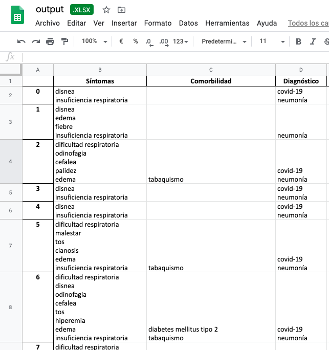
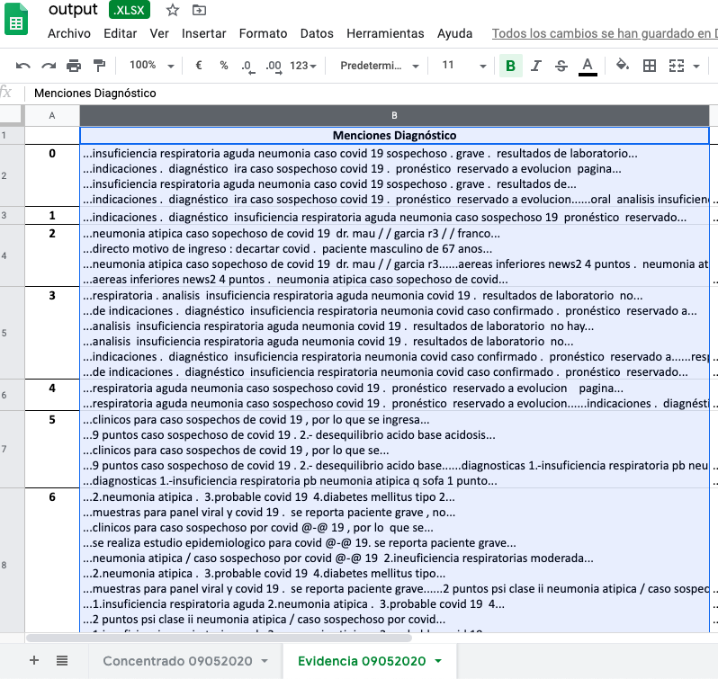
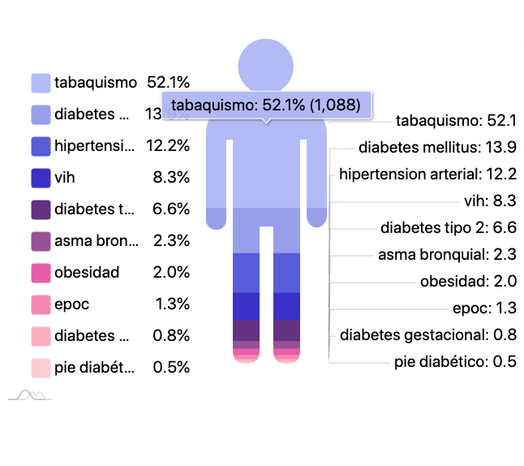
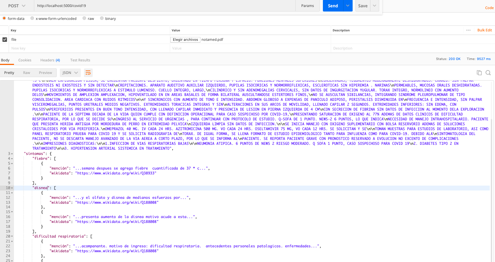

# covidminer
Text Mining Emergent Library for Information Extraction from Medical Notes in Spanish during COVID-19 pandemic


The script `demo.py` is the minimal code example in Python 3.


```
from c19mining.covid import MedNotesMiner

import simplejson as json

texto_urgencia = "Paciente masculino de 52 ..." # very long text

covid_seeker = MedNotesMiner(texto_urgencia)
covid_seeker.check_symptoms()
covid_seeker.check_sampling()
covid_seeker.check_comorbidities()

covid_insights =  json.dumps(covid_seeker.clues)
print(covid_insights)

```

Gives:

```
{
  "texto": "\nPaciente masculino de 52 afios de edad, quien acude a esta unidad acompajiado de familiar por sus propios medios.\nMotivo de ingreso: Dificultad respiratoria.\n\nAntecedentes Personales Patolégicos. Enfermedades Crénico-Degenerativas: diabetes mellitus tipo 2 desde hace 2 afios ocn mal apego a\ntratamiento ocn metformina 850 c/ 12 hrs. Alergias, traumaticos, hospitalizaciones interrogados y negados. Tabaquismo, alcoholismo,\ntoxicomanias; interrogadas y negadas.\n\nPadecimiento actual: Cuenta con antecedente de comienzo dia 26 de marzo 2020 con odinofagia sin fiebre ni tos ni rinorrea ni otros agregados\npor lo que acude a medico privado el cual dio tratamiento el cual no recuerda, sin presentar mejoria, posteriormente inicia el dia 27 de\n\nmarzo 2020, con exacerbacion del cuadro, agregandose cefalea tos fiebre no cuantificada se toma antipiretico y siente leve mejoria de la\nsintomatologia el dia 30 de marzo 2020 comienza con odinofagia intensa mialgias artralgias ataque al estado general y tos irritativa a la\nespiracion profunda , refieriendo disnea de pequefios esfuerzos motivo por el cual acude a valoracion medica.\n\nAla Exploracién Fisica: Con los Signos Vitales: 110/60 mmHg. Frecuencia Cardiaca: 84 Ipm. Frecuencia respiratoria: 36 respiraciones por minuto.\nSatO2 80%sin oxigeneo suplementario con oxigeno suplementario con mascarilla 5 Ipm 92%. Temp: 37.1 °C.\n\nPaciente con presencia d epolipnea, orientado en tiempo, lugar y espacio. Funciones mentales superiores conservadas. Tegumentos\ndeshidratados. Craneo: Sin palpar endostosis ni exostosis y sin detectar crepitaciones. Pupilas Isocéricas y normorrefléxicas, escleréticas sin\nhiperemia, Narinas permeables, mucosas orales deshidratadas. Cuello integro, corto, cilindrico y sin adenomegalias cervicales, sin datos de\ningurgitacién yugular. Térax integro, con polipnea aumento de la transmisién vocal hipoventilacién de lado izquierdo basal con presencia de\nestertores finos de predominio de lado derecho, sin integrar ningun sindrome pleuropulmonar. Area cardiaca con ruidos ritmicos y sincrénicos\npero con aumento de tono e intensidad, Abdomen globoso a expensas de paniculo adiposo, normoperistalsis, sin palpar visceromegalias ni\ndespertar puntos dolorosos a la palpacién profunda, timpanismo en todo marco colénico. Extremidades tordcicas integras y sin alteraciones en\nsus arcos de movilidad, llenado capilar 2 segundos. Extremidades inferiores: sin edema, con pulsos periféricos presentes y sincrénicos, con\nllenado capilar 4 segundos.\n\nPARACLINICOS.\ngasometria que reporta: PH 7.49 CO2 26 LACT 1.3 HCO3 19 BE -3.5\n\nBH CREATCIN 164 FA 124.5 TRIG 239 AC URI 4.1 GLUC 298 ALB 3.5 TP 10.9 TPT 28.06 INR 1.07 FIBRINOGENO 850 NA 133 K 3.95 FOSF 1.9\nCREAT 1 UREA 57.5 BUN 26.39 ALB 3.5\n\nEGO GLUC 500 CET NEGATIVO ERIT 0.03 PORT 701 LEUC 0-5 PCMP ERIT 0-5 PCM\n\nRX DE TORAX con presencia de infiltrados basales de predominio derecho\n\nPaciente de la quinta década de la vida quien presenta, seguin definicién operacional: datos clinicos para caso sospechoso por COVID-19, por lo\n\nque se ingresa a zona de aislados, para continuar con protocolo de estudio. SOFA de 3 puntos con 7% de mortalidad CURB 65 2 con 2 puntos\nriesgo moderado 6.8% PSI DE 72 PUNTOS CLASE Ii MORTALIDAD 0.9% PAFI 216.6 por lo que cursa con una insuficncia respiratoria moderada. Se\ninicia manejo con soluciones cristaloides, quinolona de tercera generacion, inhibidor de neuroaminidasa, antipirético, cloroquina, heparina de\n\nbajo peso molecular, agregandose quinolona por proceso infeccioso a nivel urinario. Se realiza estudio epidemiologico para COVID-19. Se reporta\npaciente grave con pronéstico reservado a evolucién no excento de complicaciones.\n\nImpresiones diagnosticas:\n\n1.- SEPSIS SOFA 3 PUNTOS CURB 65 DE 2 PUNTOS PSI CLASE II\nNeumonia Atipica/ CASO SOSPECHOSO POR COVID-19\n\n2.Ineuficiencia respiratorias moderada PAFI 216.6\n3.desequilibrio acido base:\n\nacidosis metabolica no compensada\n\nalcalemia\n\n4. Diabtetes Mellitus tipo 2 Descontrolada\n\n\nResultados de Laboratorio\n\n\nAMY_AMY, 49.2, U/L, 28/100,\n\nBILIRRUBINAS\n\nPFH_BIl, 0.5, mg/dl, 0,2/1,\n\nCALCIO TOTAL\n\nES2_CA, 8.7, mg/dl, 8,4/10,2,\n\n\nTRIG_TRIG, 239,23, mg/dl,\nPéptido Natiuretico (BNP) Cuantitativa Prueba Rapida\nPCP_OBS, SIN MUESTRA, -,\nDimero D Cuantitativo prueba rapida\nPCP_OBS, SIN MUESTRA, -,\nPROCALCITONINA\n\nIGM_NOTA, SIN REACTIVO, -,\nBIOMETRIA HEMATICA\nBH_NOTA, SIN MUESTRA, -,\nGASOMETRIA ARTERIAL\nGASO_THbe, 10.6,\n\nEXAMEN GENERAL DE ORINA\nEGO_BAC, ESCASAS, x campo, 0/64,\n\n\nEN ESPERA DE RECABAR MUESTRAS PARA PANEL VIRAL Y COVID 19.\n",
  "COVID-19": {
    "Q84263196": [
      {
        "descripción": "covid 19",
        "mención": "...muestras para panel viral y covid 19...",
        "wikidata": "https://www.wikidata.org/wiki/Q84263196"
      },
      {
        "descripción": "covid-19",
        "mención": "...clinicos para caso sospechoso por covid-19, por lo  que se ingresa...",
        "wikidata": "https://www.wikidata.org/wiki/Q84263196"
      },
      {
        "descripción": "covid-19",
        "mención": "...se realiza estudio epidemiologico para covid-19. se reporta paciente grave con...",
        "wikidata": "https://www.wikidata.org/wiki/Q84263196"
      },
      {
        "descripción": "covid-19",
        "mención": "...neumonia atipica/ caso sospechoso por covid-19  2.ineuficiencia respiratorias moderada pafi...",
        "wikidata": "https://www.wikidata.org/wiki/Q84263196"
      }
    ],
    "Q2633267": [
      {
        "descripción": "neumonia",
        "mención": "...2 puntos psi clase ii neumonia atipica/ caso sospechoso por covid...",
        "wikidata": "https://www.wikidata.org/wiki/Q2633267"
      },
      {
        "descripción": "neumonia atipica",
        "mención": "...2 puntos psi clase ii neumonia atipica/ caso sospechoso por covid-19...",
        "wikidata": "https://www.wikidata.org/wiki/Q2633267"
      }
    ]
  },
  "síntomas": {
    "Q35805": [
      {
        "descripción": "tos",
        "mención": "...con odinofagia sin fiebre ni tos ni rinorrea ni otros agregados...",
        "wikidata": "https://www.wikidata.org/wiki/Q35805"
      },
      {
        "descripción": "tos",
        "mención": "...exacerbacion del cuadro, agregandose cefalea tos fiebre no cuantificada se toma...",
        "wikidata": "https://www.wikidata.org/wiki/Q35805"
      },
      {
        "descripción": "tos",
        "mención": "...ataque al estado general y tos irritativa a la espiracion profunda...",
        "wikidata": "https://www.wikidata.org/wiki/Q35805"
      }
    ],
    "Q38933": [
      {
        "descripción": "fiebre",
        "mención": "...marzo 2020 con odinofagia sin fiebre ni tos ni rinorrea ni...",
        "wikidata": "https://www.wikidata.org/wiki/Q38933"
      },
      {
        "descripción": "fiebre",
        "mención": "...del cuadro, agregandose cefalea tos fiebre no cuantificada se toma antipiretico...",
        "wikidata": "https://www.wikidata.org/wiki/Q38933"
      }
    ],
    "Q86": [
      {
        "descripción": "cefalea",
        "mención": "...con exacerbacion del cuadro, agregandose cefalea tos fiebre no cuantificada se...",
        "wikidata": "https://www.wikidata.org/wiki/Q86"
      }
    ],
    "Q188008": [
      {
        "descripción": "disnea",
        "mención": "...a la espiracion profunda , refieriendo disnea de pequefios esfuerzos motivo por...",
        "wikidata": "https://www.wikidata.org/wiki/Q188008"
      },
      {
        "descripción": "dificultad respiratoria",
        "mención": "...propios medios. motivo de ingreso: dificultad respiratoria.  antecedentes personales patolégicos. enfermedades crénico...",
        "wikidata": "https://www.wikidata.org/wiki/Q188008"
      }
    ]
  },
  "muestreos": [
    {
      "mención": "...cuantitativa prueba rapida pcp_obs, sin muestra, -, dimero d cuantitativo prueba rapida..."
    },
    {
      "mención": "...pcp_obs, sin muestra, -, procalcitonina  igm_nota, sin reactivo, -, biometria..."
    },
    {
      "mención": "...hematica bh_nota, sin muestra, -, gasometria arterial gaso_thbe, 10.6..."
    },
    {
      "mención": "...64,   en espera de recabar muestras para panel viral y covid..."
    }
  ],
  "comorbilidades": {
    "Q12206": [
      {
        "descripción": "diabetes mellitus",
        "mención": "...personales patolégicos. enfermedades crénico-degenerativas: diabetes mellitus tipo 2 desde hace 2...",
        "wikidata": "https://www.wikidata.org/wiki/Q12206"
      },
      {
        "descripción": "diabetes",
        "mención": "...personales patolégicos. enfermedades crénico-degenerativas: diabetes mellitus tipo 2 desde hace...",
        "wikidata": "https://www.wikidata.org/wiki/Q12206"
      }
    ],
    "Q3025883": [
      {
        "descripción": "diabetes mellitus tipo 2",
        "mención": "...personales patolégicos. enfermedades crénico-degenerativas: diabetes mellitus tipo 2 desde hace 2 afios ocn...",
        "wikidata": "https://www.wikidata.org/wiki/Q3025883"
      }
    ],
    "Q662860": [
      {
        "descripción": "tabaquismo",
        "mención": "...traumaticos, hospitalizaciones interrogados y negados. tabaquismo, alcoholismo, toxicomanias; interrogadas y negadas...",
        "wikidata": "https://www.wikidata.org/wiki/Q662860"
      }
    ]
  }
}
```


When text extraction from PDF files without selectable text (or, even worst from images) is needed you must apply the OCR class included before mining the information.


```
from c19mining.ocr import TesseOCR

my_ocr = TesseOCR('spa')
texto_urgencia = my_ocr.get_text_from_pdf('data/notamed.pdf')

```

Anyway, from the extracted data its possible to get counts and tables for symptoms and comorbidities and finally make reports and visualizations. I created the following outcomes from a collection of medical notes. The chart was made just by formating the comorbs data frame to be compatible with amCharts ©.

```
from c19mining.report import PlotGenerator

    notes_directory = sys.argv[1]

    # build a excel report for all notes in a directory
    report = ReportGenerator(notes_directory)
    report.to_excel()

    # data for amChart
    amchart_gen = AmchartsGenerator()
    am_symptoms = amchart_gen.pictorial_stacked_chart(report.df_symptoms, 10)
    am_comorbs = amchart_gen.pictorial_stacked_chart(report.df_comorbs, 10)
```

check this out








## Dependencies

For Python 3 dependencies see `requirements.txt`. A quick installation with pip is recommended.

```
pip install  -r docs/requirements.txt
```

In addition to the Python 3 libraries it is required to install [tesseract](https://github.com/tesseract-ocr/tesseract/wiki) and [Poppler](https://poppler.freedesktop.org/) for OCR support.

Mac:

```
$brew install tesseract
$brew install tesseract-esp
$brew install poppler
```

linux:

```
$sudo apt install tesseract-ocr
$sudo apt-get install tesseract-ocr-spa
sudo add-apt-repository -y ppa:cran/poppler
sudo apt-get update
sudo apt-get install -y libpoppler-cpp-dev
```

## Running as a Lightweight Web service

Functionality can be also used through lightweight web services implemented with Flask. However, the use of a professional Web Server Gateway Interface for professional applications is recommended.

Having installed and configured what is necessary (see Dependencies section and docs/devnotes), you can run the server with the following command:


```
$python app.py

 * Serving Flask app "app" (lazy loading)
 * Environment: production
   WARNING: This is a development server. Do not use it in a production deployment.
   Use a production WSGI server instead.
 * Debug mode: off
INFO:  * Running on http://0.0.0.0:5000/ (Press CTRL+C to quit)
```

Then, with the server running you can now make POST requests sending PDF files.




## Built With

* [Wikidata](https://www.wikidata.org/) - The free knowledge base with 82,849,340 data items that anyone can edit.
* [Tesseract](https://github.com/tesseract-ocr/tesseract/wiki) - An open source text recognition (OCR) Engine.
* [Flask](https://rometools.github.io/rome/) - The Python micro framework for building web applications.


## Authors

**Alejandro Molina-Villegas**

* [dblp](https://dblp.uni-trier.de/pers/hd/m/Molina=Villegas:Alejandro)
* [orcid](https://orcid.org/0000-0001-9398-8844)
* [CONACyT-CentroGeo](http://mid.geoint.mx/site/integrante/id/15.html)

See also the list of [contributors]() who participate in this project.

## Institutions

  * [CentroGeo](https://www.centrogeo.org.mx/) - Centro de Investigación en Ciencias de Información Geoespacial.
  * [GeoInt](http://www.geoint.mx/) - Laboratorio Nacional de Geointeligencia.
  * [DataLab](http://datalab.geoint.mx/site/contacto.html#Core_Members) - DataLab

## License

This project is licensed under the MIT License - see the [LICENSE](docs/LICENSE) file for details. 

Permission is hereby granted, free of charge, to any person obtaining a copy
of this software and associated documentation files (the "Software"), to deal
in the Software without restriction, including without limitation the rights
to use, copy, modify, merge, publish, distribute, sublicense, and/or sell
copies of the Software, and to permit persons to whom the Software is
furnished to do so, subject to the following conditions:

The above copyright notice and this permission notice shall be included in all
copies or substantial portions of the Software.

THE SOFTWARE IS PROVIDED "AS IS", WITHOUT WARRANTY OF ANY KIND, EXPRESS OR
IMPLIED, INCLUDING BUT NOT LIMITED TO THE WARRANTIES OF MERCHANTABILITY,
FITNESS FOR A PARTICULAR PURPOSE AND NONINFRINGEMENT. IN NO EVENT SHALL THE
AUTHORS OR COPYRIGHT HOLDERS BE LIABLE FOR ANY CLAIM, DAMAGES OR OTHER
LIABILITY, WHETHER IN AN ACTION OF CONTRACT, TORT OR OTHERWISE, ARISING FROM,
OUT OF OR IN CONNECTION WITH THE SOFTWARE OR THE USE OR OTHER DEALINGS IN THE
SOFTWARE.


