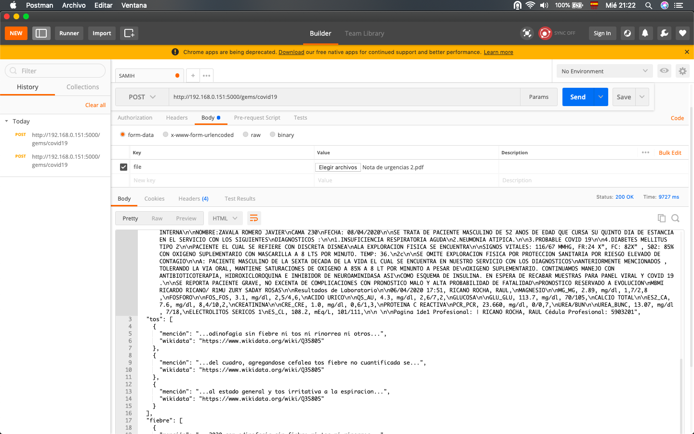

# covidminer
Text Mining Emergent Library for Information Extraction from Medical Notes in Spanish during COVID-19 pandemic


```
from gems.covid import MedNotesMiner
import simplejson as json

covid_symptoms = 'resources/sintomas.csv'
covid_sampling = 'resources/muestras.txt'
covid_seeker = MedNotesMiner(text_string, covid_symptoms, covid_sampling)
covid_seeker.check_symptoms()
covid_seeker.check_sampling()

covid_insights =  json.dumps(covid_seeker.clues)
print(covid_insights)
```

Gives you:

```
{
  "texto": "\nPaciente masculino de 52 años de edad, quien acude a esta unidad acompajiado de familiar por sus propios medios.\nMotivo de ingreso: Dificultad respiratoria.\n\nAntecedentes Personales Patolégicos. Enfermedades Crénico-Degenerativas: diabetes mellitus tipo 2 desde hace 2 años ocn mal apego a\ntratamiento ocn metformina 850 c/ 12 hrs. Alergias, traumaticos, hospitalizaciones interrogados y negados. Tabaquismo, alcoholismo,\ntoxicomanias; interrogadas y negadas.\n\nPadecimiento actual: Cuenta con antecedente de comienzo dia 26 de marzo 2020 con odinofagia sin fiebre ni tos ni rinorrea ni otros agregados\npor lo que acude a medico privado el cual dio tratamiento el cual no recuerda, sin presentar mejoria, posteriormente inicia el dia 27 de\n\nmarzo 2020, con exacerbacion del cuadro, agregandose cefalea tos fiebre no cuantificada se toma antipiretico y siente leve mejoria de la\nsintomatologia el dia 30 de marzo 2020 comienza con odinofagia intensa mialgias artralgias ataque al estado general y tos irritativa a la\nespiracion profunda , refieriendo disnea de pequefios esfuerzos motivo por el cual acude a valoracion medica.\n\nAla Exploracién Fisica: Con los Signos Vitales: 110/60 mmHg. Frecuencia Cardiaca: 84 Ipm. Frecuencia respiratoria: 36 respiraciones por minuto.\nSatO2 80%sin oxigeneo suplementario con oxigeno suplementario con mascarilla 5 Ipm 92%. Temp: 37.1 °C.\n\nPaciente con presencia d epolipnea, orientado en tiempo, lugar y espacio. Funciones mentales superiores conservadas. Tegumentos\ndeshidratados. Craneo: Sin palpar endostosis ni exostosis y sin detectar crepitaciones. Pupilas Isocéricas y normorrefléxicas, escleréticas sin\nhiperemia, Narinas permeables, mucosas orales deshidratadas. Cuello integro, corto, cilindrico y sin adenomegalias cervicales, sin datos de\ningurgitacién yugular. Térax integro, con polipnea aumento de la transmisién vocal hipoventilacién de lado izquierdo basal con presencia de\nestertores finos de predominio de lado derecho, sin integrar ningun sindrome pleuropulmonar. Area cardiaca con ruidos ritmicos y sincrénicos\npero con aumento de tono e intensidad, Abdomen globoso a expensas de paniculo adiposo, normoperistalsis, sin palpar visceromegalias ni\ndespertar puntos dolorosos a la palpacién profunda, timpanismo en todo marco colénico. Extremidades tordcicas integras y sin alteraciones en\nsus arcos de movilidad, llenado capilar 2 segundos. Extremidades inferiores: sin edema, con pulsos periféricos presentes y sincrénicos, con\nllenado capilar 4 segundos.\n\nPARACLINICOS.\ngasometria que reporta: PH 7.49 CO2 26 LACT 1.3 HCO3 19 BE -3.5\n\nBH CREATCIN 164 FA 124.5 TRIG 239 AC URI 4.1 GLUC 298 ALB 3.5 TP 10.9 TPT 28.06 INR 1.07 FIBRINOGENO 850 NA 133 K 3.95 FOSF 1.9\nCREAT 1 UREA 57.5 BUN 26.39 ALB 3.5\n\nEGO GLUC 500 CET NEGATIVO ERIT 0.03 PORT 701 LEUC 0-5 PCMP ERIT 0-5 PCM\n\nRX DE TORAX con presencia de infiltrados basales de predominio derecho\n\nPaciente de la quinta década de la vida quien presenta, seguin definicién operacional: datos clinicos para caso sospechoso por COVID-19, por lo\n\nque se ingresa a zona de aislados, para continuar con protocolo de estudio. SOFA de 3 puntos con 7% de mortalidad CURB 65 2 con 2 puntos\nriesgo moderado 6.8% PSI DE 72 PUNTOS CLASE Ii MORTALIDAD 0.9% PAFI 216.6 por lo que cursa con una insuficncia respiratoria moderada. Se\ninicia manejo con soluciones cristaloides, quinolona de tercera generacion, inhibidor de neuroaminidasa, antipirético, cloroquina, heparina de\n\nbajo peso molecular, agregandose quinolona por proceso infeccioso a nivel urinario. Se realiza estudio epidemiologico para COVID-19. Se reporta\npaciente grave con pronéstico reservado a evolucién no excento de complicaciones.\n\nImpresiones diagnosticas:\n\n1.- SEPSIS SOFA 3 PUNTOS CURB 65 DE 2 PUNTOS PSI CLASE II\nNeumonia Atipica/ CASO SOSPECHOSO POR COVID-19\n\n2.Ineuficiencia respiratorias moderada PAFI 216.6\n3.desequilibrio acido base:\n\nacidosis metabolica no compensada\n\nalcalemia\n\n4. Diabtetes Mellitus tipo 2 Descontrolada\n\n\nResultados de Laboratorio\n\n\nAMY_AMY, 49.2, U/L, 28/100,\n\nBILIRRUBINAS\n\nPFH_BIl, 0.5, mg/dl, 0,2/1,\n\nCALCIO TOTAL\n\nES2_CA, 8.7, mg/dl, 8,4/10,2,\n\n\nTRIG_TRIG, 239,23, mg/dl,\nPéptido Natiuretico (BNP) Cuantitativa Prueba Rapida\nPCP_OBS, SIN MUESTRA, -,\nDimero D Cuantitativo prueba rapida\nPCP_OBS, SIN MUESTRA, -,\nPROCALCITONINA\n\nIGM_NOTA, SIN REACTIVO, -,\nBIOMETRIA HEMATICA\nBH_NOTA, SIN MUESTRA, -,\nGASOMETRIA ARTERIAL\nGASO_THbe, 10.6,\n\nEXAMEN GENERAL DE ORINA\nEGO_BAC, ESCASAS, x campo, 0/64,\n\n\nEN ESPERA DE RECABAR MUESTRAS PARA PANEL VIRAL Y COVID 19.\n",
  "síntomas": {
    "tos": [
      {
        "mención": "...odinofagia sin fiebre ni tos ni rinorrea ni otros...",
        "wikidata": "https://www.wikidata.org/wiki/Q35805"
      },
      {
        "mención": "...odinofagia sin fiebre ni tos ni rinorrea ni otros...",
        "wikidata": "https://www.wikidata.org/wiki/Q35805"
      },
      {
        "mención": "...del cuadro, agregandose cefalea tos fiebre no cuantificada se...",
        "wikidata": "https://www.wikidata.org/wiki/Q35805"
      },
      {
        "mención": "...al estado general y tos irritativa a la espiracion...",
        "wikidata": "https://www.wikidata.org/wiki/Q35805"
      }
    ],
    "fiebre": [
      {
        "mención": "...2020 con odinofagia sin fiebre ni tos ni rinorrea...",
        "wikidata": "https://www.wikidata.org/wiki/Q38933"
      },
      {
        "mención": "...2020 con odinofagia sin fiebre ni tos ni rinorrea...",
        "wikidata": "https://www.wikidata.org/wiki/Q38933"
      },
      {
        "mención": "...cuadro, agregandose cefalea tos fiebre no cuantificada se toma...",
        "wikidata": "https://www.wikidata.org/wiki/Q38933"
      }
    ],
    "cefalea": [
      {
        "mención": "...exacerbacion del cuadro, agregandose cefalea tos fiebre no cuantificada...",
        "wikidata": "https://www.wikidata.org/wiki/Q86"
      },
      {
        "mención": "...exacerbacion del cuadro, agregandose cefalea tos fiebre no cuantificada...",
        "wikidata": "https://www.wikidata.org/wiki/Q86"
      }
    ],
    "disnea": [
      {
        "mención": "...la espiracion profunda , refieriendo disnea de pequefios esfuerzos motivo...",
        "wikidata": "https://www.wikidata.org/wiki/Q188008"
      },
      {
        "mención": "...la espiracion profunda , refieriendo disnea de pequefios esfuerzos motivo...",
        "wikidata": "https://www.wikidata.org/wiki/Q188008"
      }
    ],
    "dificultad respiratoria": [
      {
        "mención": "...medios. motivo de ingreso: dificultad respiratoria.  antecedentes personales patolégicos. enfermedades...",
        "wikidata": "https://www.wikidata.org/wiki/Q188008"
      },
      {
        "mención": "...medios. motivo de ingreso: dificultad respiratoria.  antecedentes personales patolégicos. enfermedades...",
        "wikidata": "https://www.wikidata.org/wiki/Q188008"
      }
    ]
  },
  "muestreos": [
    {
      "mención": "...prueba rapida pcp_obs, sin muestra, -, dimero d cuantitativo prueba..."
    },
    {
      "mención": "...rapida pcp_obs, sin muestra, -, procalcitonina  igm_nota, sin reactivo..."
    },
    {
      "mención": "...biometria hematica bh_nota, sin muestra, -, gasometria arterial gaso_thbe, 10..."
    },
    {
      "mención": "...en espera de recabar muestras para panel viral y..."
    }
  ]
}
```

## As a Lightweight Web service

Functionality can be lso used through lightweight web services implemented with Flask. However, the use of a professional Web Server Gateway Interface for professional applications is recommended.

Having installed and configured what is necessary (see Dependencies section and docs/devnotes), you can run the server with the following command:


```
$python app.py

 * Serving Flask app "app" (lazy loading)
 * Environment: production
   WARNING: This is a development server. Do not use it in a production deployment.
   Use a production WSGI server instead.
 * Debug mode: off
INFO:  * Running on http://0.0.0.0:5000/ (Press CTRL+C to quit)
```

Then, with the server running you can now make POST requests sending PDF files.



